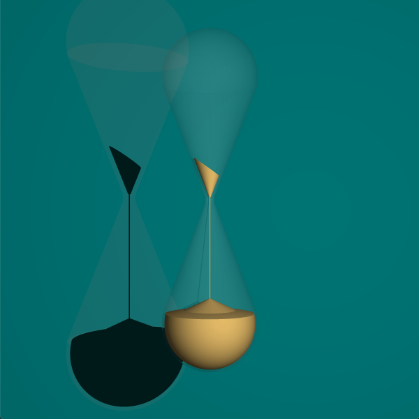
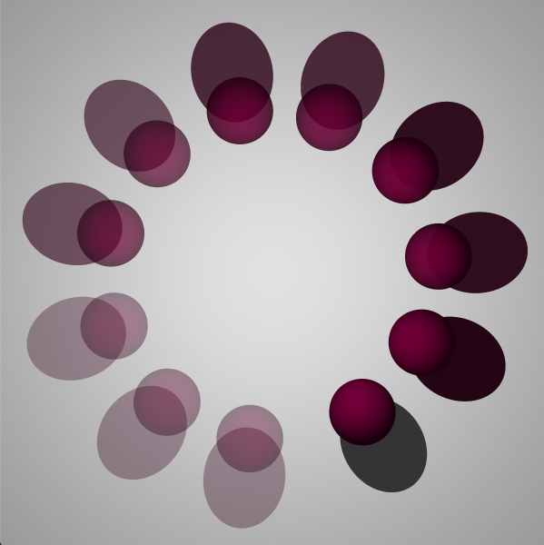

# RT

RT stands for ray tracing - powerful algorithm for representing 3D things in 2D, like on the picture down:

It's a sand clock with a wall behind it. The clock itself is 99% transparent while sand is not. Thats why the shadow casted by clock glass is barely visible and the shadow of sand is almost black.

On the screenshot below notice the stained glass effect when the colour of transparent sphere is influencing it's shadow color.

That's all for now. Stay tuned.
